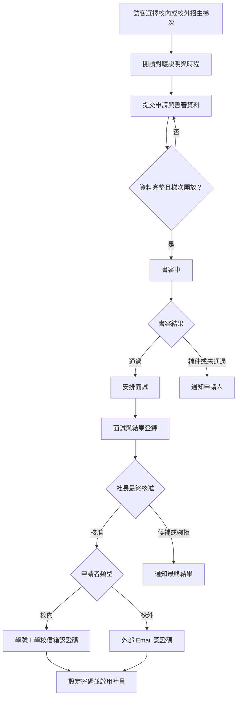
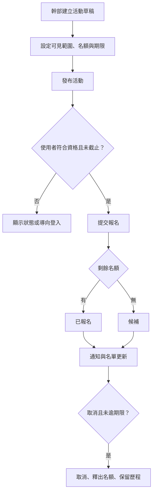
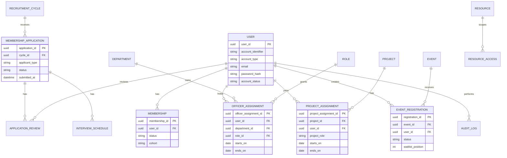
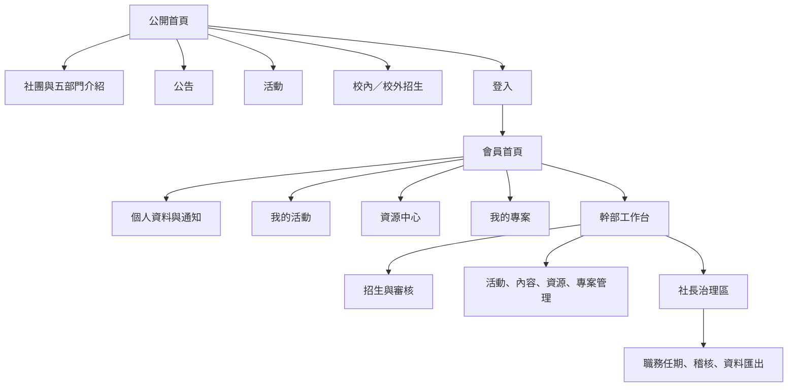

# FJUBAC 社團資訊網站：專案主文件

**版本：** 1.0  
**文件狀態：** 整合定版；可進入 MVP 的設計、資料庫與 staging 開發。  
**產品決策者：** 社長。  
**暫代網站負責人：** 社長。  
**整合日期：** 2026-08-26（GMT+8）  
**文件目的：** 將 Instagram 公開內容研究、系統分析、功能盤點、實作前準備、組織治理與已確認決策整合為單一事實來源（Single Source of Truth）。若本文件與早期草案衝突，應以本文件的「已確認決策」與「MVP 定版規格」為準。

---

## 目錄

1. [專案背景與研究基礎](#1-專案背景與研究基礎)
2. [研究方法、範圍與公開內容發現](#2-研究方法範圍與公開內容發現)
3. [網站目標、範圍與成功原則](#3-網站目標範圍與成功原則)
4. [使用者角色、組織與權限治理](#4-使用者角色組織與權限治理)
5. [MVP 功能需求矩陣](#5-mvp-功能需求矩陣)
6. [核心作業流程與商業規則](#6-核心作業流程與商業規則)
7. [資料模型、狀態與存取範圍](#7-資料模型狀態與存取範圍)
8. [資訊架構、RWD 與可近用性](#8-資訊架構rwd-與可近用性)
9. [技術架構、安全、測試與營運](#9-技術架構安全測試與營運)
10. [功能優先順序與開發路線圖](#10-功能優先順序與開發路線圖)
11. [上線治理門檻與風險](#11-上線治理門檻與風險)
12. [研究報告網站視覺方向](#12-研究報告網站視覺方向)
13. [來源追溯與參考資料](#13-來源追溯與參考資料)

---

## 1. 專案背景與研究基礎

FJUBAC（輔大商業分析社）對外公開內容顯示，社團以**商業分析、管理顧問方法、專案實作、職涯連結與社群招募**為主要脈絡。公開內容將社課、專案、企業參訪、Coffee Chat、實習訪談與招生說明串接成學生從能力培養到職涯探索的成長路徑。[R1] [R2]

本網站不應只是靜態形象頁，而應成為兼顧對外資訊、社員服務、專案運作與幹部治理的社團數位基礎設施。其設計必須支援訪客、社員、專案生、幹部與社長／暫代網站負責人在不同裝置上完成各自任務，且對個人資料、專案資料與治理資料採適當的權限邊界。

| 對外研究發現 | 對網站設計的啟示 |
| --- | --- |
| 社課與分析方法內容占可核對樣本的重要比例。 | 網站需要社員教材、學術公告與資源分類，而不只放活動海報。 |
| 專案成果、期中發表與成員經驗是公開敘事的一部分。 | 系統需要「專案」與「專案生指派」概念，讓專案資料不散落於聊天工具。 |
| Coffee Chat、企業參訪與實習訪談顯示職涯連結是核心價值。 | 活動模組應支援名額、報名、候補、出席與公開／內部範圍。 |
| 招募說明、新生經驗與加入迷思回應反覆出現。 | 公開區應提供清楚的校內／校外招生說明、時程、書審與面試流程。 |

---

## 2. 研究方法、範圍與公開內容發現

### 2.1 研究範圍與限制

研究於 2026-08-26 在**非帳號管理者、未登入 Instagram**的情境下進行。帳號個人檔案在瀏覽器中出現登入限制，因此不能誠實宣稱已取得帳號所有貼文、Reels 或精選動態逐則內容。本研究以公開索引與可直接核對的公開網址為依據，將「可見」與「不可驗證」清楚區分。[R1]

| 可核對範圍 | 研究結果 | 使用原則 |
| --- | ---: | --- |
| 直接核對之公開貼文／Reels | 19 則，其中 13 則貼文、6 支 Reels。 | 僅對已核對樣本進行分類與互動觀察。 |
| 可辨識精選動態 | 7 組名稱。 | 只分析名稱層級結構，不推論逐則限動內容。 |
| 有可見按讚的條目 | 15 則，合計 552 個讚、平均 36.8 個讚。 | 不視為全帳號平均互動率，也不以缺失值補 0。 |
| 帳號快照 | 公開索引曾顯示約 531–532 名追蹤者、29 個追蹤中與 123 則貼文。 | 這些數字隨時間變動，不作為長期績效指標。 |

> **完整性聲明：** 若要取得完整、可稽核的貼文、Reels 與精選動態清單，應由帳號管理者提供官方匯出資料或授權資料存取。在此前，任何「完全涵蓋所有公開內容」的說法都不應被採信。

### 2.2 內容結構與趨勢

| 主題類別 | 已核對條目數 | 典型內容 | 內容功能 |
| --- | ---: | --- | --- |
| 技能與方法知識 | 7 | 量化分析、效益評估、個案面試、產業分析、目標設定。 | 提供可操作的分析框架。 |
| 活動與職涯連結 | 7 | Coffee Chat、企業參訪、實習訪談、外部課程資源。 | 將學生與講師、校友、企業、職涯議題連結。 |
| 社群招募與定位 | 5 | 社員心得、新生經驗談、招募說明會、加入迷思回應。 | 降低加入門檻並具體化社團價值。 |

| 時段 | 可觀察內容方向 | 代表證據 |
| --- | --- | --- |
| 2023–2024 | 方法論、年度目標與社團定位。 | 年度目標框架、第一屆社員心得、社團介紹。[R2] [R7] |
| 2025 | 專案成果、Coffee Chat、實習與新生溝通。 | 期中發表、Coffee Chat、實習訪談、新生經驗談。[R3] [R8] [R9] |
| 2026 上半年 | 招募、企業參訪、工作坊、課程回顧與產業分析。 | 招募說明會、SHOPLINE 參訪、個案面試、效益評估、航空業分析。[R5] [R6] [R10] |

在已核對樣本中，可見按讚較高的內容包括新生經驗談 Reels（72）、Coffee Chat 預告（61）、航空業分析（51）、實習訪談（49）與期中發表（41）。這支持一項保守觀察：**具體職涯情境、成員／校友觀點與可立即取用的產業或活動資訊，在已核對樣本中較容易引起可見反應。** 不過，因曝光條件與可見互動欄位不完整，這不是因果或演算法績效結論。[R3] [R6] [R8] [R9]

### 2.3 已核對公開內容索引

| 日期 | 類型 | 主題 | 可驗證重點 | 可見互動線索 |
| --- | --- | --- | --- | --- |
| 2023-12-30 | 貼文 | 2024 達成你的年度目標 | 以釐清現況、建立途徑、拆分任務、持續追蹤設定目標。 | 無可見留言。 [R7] |
| 2024-09-26 | Reels | 第一屆社員心得 | 以社員經驗呈現社團樣貌。 | 無可用互動欄位。 [R11] |
| 2024-12-18 | Reels | FJUBAC 商業分析社介紹 | 提及社課、專案、活動與人脈拓展。 | 無可用互動欄位。 [R2] |
| 2025-05-07 | 貼文 | 第三屆期中發表 | 市場分析、策略規劃與成果回饋。 | 41 讚。 [R12] |
| 2025-05-15 | 貼文 | Coffee Chat｜換桌論壇 | 跨領域講者、論壇、換桌與自由交流。 | 61 讚。 [R8] |
| 2025-09-09 | Reels | 新生必看｜BAC 經驗談 | AMA、說明會與幹部／講師經驗。 | 72 讚、7 留言。 [R3] |
| 2025-11-10 | Reels | 實習訪談 | 前副社長職涯經驗。 | 49 讚、5 留言。 [R9] |
| 2025-12-03 | 貼文 | 社課回顧｜量化分析 | 比較、構成、趨勢、分布、關聯性的圖表對應。 | 17 讚。 [R4] |
| 2026-02-28 | 貼文 | 招募說明會 | 社課、專案、個案分析、Coffee Chat、Bonding。 | 41 讚。 [R10] |
| 2026-03-12 | Reels | 你以為的 vs 實際上的 BAC | 回應加入門檻與競爭壓力。 | 36 讚、3 留言。 [R13] |
| 2026-04-21 | Reels | FJUBAC × SHOPLINE 企業參訪 | HR 訪談、集合地點、名額與保證金。 | 27 讚。 [R14] |
| 2026-05-22 | 貼文 | SHOPLINE 參訪心得 | 企業運作、主管經驗與履歷健檢。 | 37 讚、1 留言。 [R15] |
| 2026-05-25 | 貼文 | 個案面試工作坊 | 個案拆解、履歷、行為面試與假說驅動。 | 23 讚。 [R16] |
| 2026-05-29 | 貼文 | Google 數位人才探索計畫 | 雲端、數位行銷與 AI 職場通識學程。 | 32 讚、2 留言。 [R17] |
| 2026-05-31 | 貼文 | Google 數位人才探索計畫 | AI 時代的數位能力與學程。 | 無可用互動欄位。 [R18] |
| 2026-06-01 | 貼文 | 個案面試工作坊回顧 | 政策投報率評估與議題樹。 | 19 讚。 [R19] |
| 2026-06-03 | 貼文 | 社課回顧｜效益評估 | OKR、SMART、領先／落後指標與效益管理。 | 18 讚。 [R5] |
| 2026-06-04 | 貼文 | Coffee Chat 回顧 | 行銷、管顧、金融領域職涯交流。 | 28 讚。 [R20] |
| 2026-06-10 | 貼文 | 航空業獲利解構 | 哩程、競爭格局、消費者行為與供需。 | 51 讚。 [R6] |

可辨識精選動態名稱為：**Q&A、職場預備課：如何找到第一份工作、BAC 日常、說明會倒數、Threads 鍊的知識、社課旁聽資訊ℹ️、職涯地圖馬拉松**。這些名稱呼應招募、知識輸出與社群日常三層結構，但本研究未取得精選中的逐則內容。[R1]

---

## 3. 網站目標、範圍與成功原則

### 3.1 專案目標

建立一個具完整 RWD 的社團專屬資訊網站，讓社團以單一入口呈現品牌、招生、公告與活動，同時對內提供社員、專案生與幹部所需的會員、資源、專案與治理能力。網站必須在 PC、Tablet、Mobile 都能完成核心任務，且不能出現非必要水平捲動、文字重疊或操作中斷。

| 範圍層級 | MVP 納入 | 暫不自行開發 |
| --- | --- | --- |
| 對外資訊 | 社團介紹、五部門介紹、公告、活動、校內／校外招生說明與申請。 | 自建社群動態牆、公開留言板。 |
| 會員服務 | 帳號啟用、登入、個人資料、活動報名、資源、專案資料。 | 即時聊天、金流、複雜問卷。 |
| 幹部作業 | 書審、面試、內容、活動、資源、專案指派、任期與交接。 | 複雜 BPM、完整 CRM、企業級多租戶。 |
| 系統治理 | RBAC、稽核、角色與任期、帳號停用、資料匯出。 | 自建校務 SSO、多校組織治理。 |

### 3.2 成功原則

| 原則 | 實作意義 |
| --- | --- |
| **證據與可追溯性** | 招生、權限、核准、發布、撤權與匯出都需留存可稽核歷程。 |
| **最小必要權限** | 幹部只取得其部門與被指派資料所需的權限；前端隱藏按鈕不取代後端授權。 |
| **角色與資料分離** | 專案生是專案指派，幹部是職務指派；同一人可同時具社員、專案生與幹部身份。 |
| **Mobile-first** | 招生申請、認證、登入、報名與專案資源讀取必須可在手機完成。 |
| **可交接性** | 以任期、交接清單、稽核與資產治理降低幹部換屆風險。 |

---

## 4. 使用者角色、組織與權限治理

### 4.1 使用者角色

| 角色 | 系統定義 | 核心目標 | 權限邊界 |
| --- | --- | --- | --- |
| **訪客** | 未登入或未具有效社員資格者。 | 瀏覽公開資訊、了解招生、提交申請。 | 僅能讀取公開資料。 |
| **申請者** | 已依招生梯次送件、尚未獲最終核准者。 | 提交書審資料、查看補件／面試／結果狀態。 | 僅能讀取與維護本人的申請。 |
| **社員** | `Membership.status = ACTIVE` 的使用者。 | 報名活動、讀取社員資源、管理自身資料。 | 無法讀取其他社員個資或管理全站內容。 |
| **專案生** | 具有效 `ProjectAssignment` 的社員。 | 參與專案實作、讀取所屬專案公告與資源。 | 只可存取被指派專案。 |
| **幹部** | 具有效 `OfficerAssignment` 的社員。 | 管理部門授權的內容、活動、資源或專案。 | 不得自動取得跨部門、稽核或最終核准權。 |
| **社長／暫代網站負責人** | 產品決策者與最高治理角色。 | 最終核准、任期、跨部門例外、稽核與上線責任。 | 高風險操作需再次確認並留存稽核。 |

### 4.2 五部門模型與資料範圍

| 部門 | 英文名稱 | 核心系統責任 | 預設管理範圍 |
| --- | --- | --- | --- |
| 人才發展部 | Talent Acquisition & Engagement | 招生、書審、面試、社員互動。 | 招生梯次、申請、書審、面試與受指派活動。 |
| 專案開發部 | Project Development & Management | 專案建立、專案生指派、專案營運。 | 專案、專案指派、專案公告與專案資源。 |
| 對外發展部 | External Affairs | 對外合作、對外活動與聯絡窗口。 | 受指派對外活動、公開合作內容與聯絡紀錄。 |
| 學術營運部 | Academic Operations | 社課、學術活動、教材與學習資源。 | 學術活動、社員教材、學術公告與資源。 |
| 行銷策略部 | Marketing Strategy | 品牌、公開內容、宣傳與公開頁。 | 首頁、公開公告、公開活動頁與宣傳資源。 |

### 4.3 權限群組

| 權限群組 | 預設持有人 | 代表操作 |
| --- | --- | --- |
| `recruitment.review` | 人才發展部長＋指定幹部。 | 查看申請、書審、面試與登錄結果。 |
| `recruitment.approve.final` | 社長。 | 最終核准、候補、婉拒與啟用社員資格。 |
| `project.manage.department` | 專案開發部授權幹部。 | 建立專案、指派專案生、管理所屬資料。 |
| `event.manage.department` | 受活動指派的各部門幹部。 | 建立、發布、管理活動與名單。 |
| `resource.manage.department` | 資源擁有部門幹部。 | 建立、分類與設定資源可見範圍。 |
| `content.manage.public` | 行銷策略部；必要時對外發展部。 | 管理公開公告、首頁與宣傳內容。 |
| `officer.assign` | 社長／暫代網站負責人。 | 指派職務、任期、撤權與交接。 |
| `audit.read.global` | 社長／暫代網站負責人。 | 讀取跨部門稽核與高風險操作。 |

---

## 5. MVP 功能需求矩陣

| ID | 功能需求 | 訪客／申請者 | 社員／專案生 | 幹部 | 社長／暫代網站負責人 | 核心驗收條件 |
| --- | --- | --- | --- | --- | --- | --- |
| FR-01 | 公開首頁、社團與五部門介紹、聯絡方式。 | 讀取。 | 讀取。 | 管理授權內容。 | 全域管理。 | 未登入可讀取，SEO 與分享預覽正確。 |
| FR-02 | 公開公告與活動列表，含日期、類別、關鍵字搜尋。 | 讀取。 | 讀取。 | 管理授權內容。 | 全域管理。 | 下架內容不可公開顯示。 |
| FR-03 | 校內／校外招生梯次、差異化說明與時程。 | 讀取與選擇梯次。 | — | 人才發展部管理。 | 最終治理。 | 梯次時程、說明、申請資格正確。 |
| FR-04 | 入社申請、書審、補件、面試與結果追蹤。 | 建立／讀取本人申請。 | — | 審核與安排面試。 | 最終核准。 | 審核者、時間、結果與原因可追溯。 |
| FR-05 | 校內／校外帳號啟用、登入、登出與密碼重設。 | 核准後啟用。 | 使用。 | 使用。 | 管理帳號狀態。 | 校內學號／校外 Email＋一次性 Email 認證碼後才能設密碼。 |
| FR-06 | 個人資料與通知偏好。 | — | 維護本人。 | 維護本人。 | 管理帳號狀態。 | 僅能修改本人資料；欄位格式受驗證。 |
| FR-07 | 活動建立、範圍、名額、報名、候補、取消與基本出席。 | 視公開活動讀取。 | 報名與取消本人。 | 管理授權活動。 | 全域治理。 | 名額與候補由後端交易判定，不得超收。 |
| FR-08 | 四級資源中心。 | 讀取公開資源。 | 讀取社員／所屬專案資源。 | 管理所屬資源。 | 全域管理。 | 每次下載皆重驗公開／社員／專案／幹部範圍。 |
| FR-09 | 專案建立、專案生指派、專案公告與專屬資源。 | — | 專案生讀取所屬資料。 | 專案開發部管理。 | 全域治理。 | 專案生必為有效社員；結束指派即回收存取。 |
| FR-10 | 公告、頁面、草稿、發布、排程與下架。 | 讀取公開內容。 | 讀取授權內容。 | 管理所屬內容。 | 全域管理。 | 草稿、發布、下架與發布者歷程可追溯。 |
| FR-11 | 網站內與 Email 通知。 | 接收申請結果。 | 接收報名、活動與權限通知。 | 建立所屬通知。 | 全域治理。 | 發送對象、狀態、時間與失敗紀錄可查。 |
| FR-12 | 幹部職務、部門、開始／結束日、提醒與自動撤權。 | — | — | 讀取自身職務。 | 指派與管理。 | 結束前 30 天與 7 天提醒；結束日自動移除職務權限。 |
| FR-13 | 稽核、資料匯出與基本營運報表。 | — | 查看本人紀錄。 | 查看所屬範圍。 | 全域檢視／匯出。 | 高風險操作採 append-only 歷程。 |
| FR-14 | RWD、鍵盤操作、表單錯誤與空狀態。 | 使用。 | 使用。 | 使用。 | 使用。 | PC、Tablet、Mobile 均可完成核心任務，無非必要水平捲動。 |

---

## 6. 核心作業流程與商業規則

### 6.1 校內／校外招生與啟用流程

| 商業規則 | 定版內容 |
| --- | --- |
| 申請程序 | 必經申請、書審、面試與社長最終核准。 |
| 招生梯次 | 至少包含 `INTERNAL` 與 `EXTERNAL`，各自有說明、開放時間、截止日、面試與結果公告。 |
| 校內帳號 | 學號為識別；認證碼寄送至已登錄學校信箱。 |
| 校外帳號 | 已驗證外部 Email 為識別；認證碼寄送至該 Email。 |
| 認證碼 | 有效期 10 分鐘、錯誤上限 5 次、重寄冷卻 60 秒；不保存明文認證碼。 |
| 審核責任 | 人才發展部長＋指定幹部進行書審／面試；社長做最終核准。 |

### 6.2 活動流程

| 商業規則 | 定版內容 |
| --- | --- |
| 活動可見範圍 | 預設社員；單一活動可設公開、專案限定或幹部限定。 |
| 名額與候補 | 後端在同一交易中判斷報名或候補；MVP 由授權幹部手動遞補。 |
| 取消 | 每場活動可設定取消期限；未設定時不自行假定。 |
| 名單隱私 | 公開頁不顯示其他社員名單。 |

### 6.3 專案生與幹部任期流程

| 流程 | 定版規則 |
| --- | --- |
| 專案生指派 | 只有有效社員可建立 `ProjectAssignment`；可同時加入多個專案；指派結束即回收該專案資料存取。 |
| 幹部任期 | 每個 `OfficerAssignment` 具部門、職務、開始日、結束日與有效狀態。 |
| 任期通知 | 系統於結束日前 30 天與 7 天通知相關人員。 |
| 自動撤權 | 到達結束日，系統在授權判斷與排程中撤除職務權限並寫入稽核。 |
| 交接 | 社長暫代網站負責人；換屆前需指定下一任、核對權限、資產、SOP、草稿與待辦。 |

---

## 7. 資料模型、狀態與存取範圍

### 7.1 概念資料模型

### 7.2 關鍵實體與資料敏感度

| 實體 | 核心欄位與約束 | 資料範圍 |
| --- | --- | --- |
| `User` | 校內學號或校外 Email 識別、Email、密碼雜湊、帳號狀態。 | 個人資料。 |
| `RecruitmentCycle` | 校內／校外類別、說明、開放／截止／面試／公告時程。 | 公開或幹部管理。 |
| `MembershipApplication` | 申請資料、申請者類型、狀態與送件時間。 | 限人才發展部授權人與社長。 |
| `ApplicationReview`／`InterviewSchedule` | 審核階段、結果、內部評語、面試時間。 | 高敏感招生資料。 |
| `Membership` | 狀態、屆別、生效期間。 | 內部個人資料。 |
| `OfficerAssignment` | 使用者、部門、角色、任期、通知與撤權資訊。 | 治理資料。 |
| `Project`／`ProjectAssignment` | 專案、指派、角色、起訖與狀態。 | 專案範圍。 |
| `Event`／`EventRegistration` | 活動、名額、範圍、報名與候補。 | 公開或內部個人資料。 |
| `Resource` | 儲存位置、分類、可見範圍、擁有者。 | 依四級範圍。 |
| `AuditLog` | 操作者、動作、目標、前後差異、時間。 | 機密治理資料；append-only。 |

### 7.3 狀態機

| 類別 | 狀態與轉換 |
| --- | --- |
| 申請 | `SUBMITTED → DOCUMENT_REVIEW → INTERVIEW_SCHEDULED → INTERVIEW_COMPLETED → APPROVED / WAITLISTED / REJECTED`；核准後進入 `ACCOUNT_ACTIVATION_PENDING → ACTIVE`。 |
| 會員 | `ACTIVE → INACTIVE / ALUMNI`，必要時由社長復原為 `ACTIVE`。 |
| 活動 | `DRAFT → PUBLISHED → REGISTRATION_OPEN → FULL / CLOSED → COMPLETED`，任意適當節點可進入 `CANCELLED`。 |
| 報名 | `REGISTERED / WAITLISTED → CANCELLED`；活動後由幹部登錄 `ATTENDED / ABSENT`。 |
| 專案 | `DRAFT → ACTIVE → COMPLETED → ARCHIVED`，或 `CANCELLED`。 |
| 指派 | `ACTIVE → ENDED / REMOVED`；結束後保留歷史但回收資料存取。 |

### 7.4 存取範圍

| 範圍 | 例子 | 存取原則 |
| --- | --- | --- |
| 公開 | 社團介紹、公開公告、公開活動、公開資源。 | 無需登入。 |
| 社員 | 社員公告、教材、本人活動紀錄。 | 需有效社員資格。 |
| 專案 | 專案公告、專案資源、專案成員。 | 需有效專案指派或該專案管理權。 |
| 幹部 | 書審、面試、活動名單、管理草稿。 | 需部門權限與資料範圍。 |
| 治理 | 角色變更、稽核、資料匯出、資產資訊。 | 僅社長／暫代網站負責人。 |

---

## 8. 資訊架構、RWD 與可近用性

### 8.1 網站架構

### 8.2 RWD 驗收規格

| 區域 | PC `≥1200px` | Tablet `768–1199px` | Mobile `320–767px` | 驗收要點 |
| --- | --- | --- | --- | --- |
| 導覽 | 完整主選單與帳號入口。 | 欄位縮減。 | 漢堡選單；招生／登入保留首層。 | 無登入者可在三次操作內找到招生。 |
| 招生與認證 | 多欄說明與表單摘要。 | 區塊上下排列。 | 單欄，認證碼支援數字鍵盤與貼上。 | 校內／校外資訊、截止日與進度清楚。 |
| 活動 | 活動資訊與報名卡可並列。 | 窄側欄或上下堆疊。 | 單欄，主要報名按鈕可見且不被鍵盤遮蔽。 | 手機可完整報名、候補或取消。 |
| 資源中心 | 側欄分類與高密度列表。 | 上方篩選。 | 卡片摘要、展開詳細欄位。 | 長檔名可讀；下載權限可理解。 |
| 名單與治理 | 桌機可使用高密度表格與批次作業。 | 可橫向檢視或摘要。 | 單筆卡片與查詢優先。 | 手機可查詢，批次操作不強迫完成。 |

### 8.3 可近用性

網站目標符合 WCAG 2.2 AA，包含可感知、可操作、可理解與穩健的內容與介面原則。[T3]

| 類別 | 規格 |
| --- | --- |
| 鍵盤與焦點 | 所有互動元件可使用 Tab、Shift+Tab、Enter、Space、Esc；焦點可見。 |
| 表單 | 每個欄位有可程式關聯的 Label、輔助說明與可朗讀錯誤訊息。 |
| 狀態 | 不只以顏色傳達草稿、候補、錯誤或完成；需同時顯示文字。 |
| 動態內容 | 載入、送出、失敗、認證碼與候補變動，以適當 `aria-live` 訊息傳達。 |
| 觸控 | 主要可點擊目標約 44×44 CSS px；避免行動版誤觸。 |
| 資料表 | 在 Mobile 改為卡片、摘要列或可展開資訊，避免壓縮到不可讀。 |

---

## 9. 技術架構、安全、測試與營運

### 9.1 首選技術棧

第一期採**Next.js＋TypeScript＋PostgreSQL 的模組化單體**。此結構可在同一程式庫處理公開頁、會員區、幹部後台與伺服端 API／BFF；在需求成長到多校、多組織、公開 API 或大量背景工作時，再評估將後端拆為 NestJS。Next.js 與 NestJS 的官方文件分別提供全端 React 與 TypeScript 後端架構能力。[T1] [T2]

| 層次 | 建議技術 | 本專案用途 |
| --- | --- | --- |
| Web 應用 | Next.js App Router＋React＋TypeScript。 | 公開 SEO、會員與幹部頁、伺服端流程。 |
| UI／RWD | Tailwind CSS＋shadcn/ui 或 Radix UI。 | 設計 token、可近用元件、跨裝置一致性。 |
| 表單與驗證 | React Hook Form＋Zod。 | 招生、活動、內容與資料驗證。 |
| 授權 | 伺服端 RBAC＋Membership／ProjectAssignment／OfficerAssignment 範圍。 | 避免僅靠前端隱藏按鈕。 |
| 資料庫 | PostgreSQL＋Prisma 或 Drizzle migration。 | 關聯式會員、角色、任期、活動、專案與稽核。 [T4] |
| 檔案 | S3 相容物件儲存。 | 權限化資源下載與檔案生命週期。 |
| 通知 | 網站內通知＋交易 Email。 | 認證碼、書審／面試、報名與任期提醒。 |
| 測試 | Vitest、React Testing Library、Playwright、Lighthouse CI。 | 單元、整合、E2E、RWD、效能與可近用性。 |

### 9.2 安全基線

| 控制 | MVP 規格 |
| --- | --- |
| 身分驗證 | 校內以學號＋學校信箱認證碼，校外以驗證 Email＋認證碼；驗證後設定密碼；session 使用安全 Cookie。 |
| 認證碼 | 有效期、錯誤上限、重寄節流與一次性使用；資料庫只保存雜湊。 |
| 授權 | 所有讀寫 API 在伺服端依使用者、角色、指派與資料範圍驗證。 |
| 輸入與檔案 | Schema 驗證、輸出編碼、上傳類型／大小限制與檔案存取檢查。 |
| 稽核 | 招生審核、最終核准、角色變更、資料匯出、公開發布、刪除與撤權寫入 append-only AuditLog。 |
| 備份 | 資料庫每日備份、檔案版本／生命週期、staging 還原演練。 |

### 9.3 測試與 UAT

| 測試層級 | 核心案例 |
| --- | --- |
| 單元測試 | 認證碼到期、名額判斷、候補、任期有效性、狀態轉換。 |
| 整合測試 | 未授權者不能讀取專案資源；核准申請建立社員資格；任期到期撤權。 |
| E2E | 校內／校外申請到啟用、社員活動報名、專案生讀取資料、幹部建活動。 |
| UAT | 人才發展部長＋指定幹部完成書審／面試；社長最終核准；社長設定幹部任期與查看稽核。 |
| RWD／可近用性 | 320px 招生與報名、Tablet 資源篩選、鍵盤操作對話框與表單錯誤。 |

---

## 10. 功能優先順序與開發路線圖

### 10.1 MVP（P0）

| 模組 | P0 內容 |
| --- | --- |
| 招生與會員 | AF-01 入社申請與社員審核、AF-02 會員生命週期、校內／校外招生梯次、書審、面試與帳號啟用。 |
| 專案 | AF-03 專案工作台基礎、專案生與指導幹部指派、專案公告與資源。 |
| 幹部治理 | AF-06 角色與任期，提醒、自動撤權、稽核與交接。 |
| 公開與社員服務 | 公開內容、活動、報名／取消／候補、四級資源、通知與 RWD。 |

### 10.2 第二期（P1）

| ID | 功能 |
| --- | --- |
| AF-04 | 專案里程碑、任務與交付物。 |
| AF-05 | 專案出席與會議紀錄。 |
| AF-07 | 活動 QR Code 報到。 |
| AF-08 | 候補自動遞補與提醒。 |
| AF-09 | 行事曆訂閱與提醒。 |
| AF-11 | 資源版本與到期控管。 |
| AF-13 | 跨屆交接包與知識地圖。 |
| D-15 | 社團共用信箱、共同資產持有與 MFA 正式化。 |

### 10.3 後續評估（P2）與暫緩項目

| 功能 | 原因與替代方式 |
| --- | --- |
| AF-10 內容審稿與雙人發布 | 組織成熟後再導入，避免 MVP 流程過重。 |
| AF-12 校友／講師資料庫 | 合作量足夠且資料治理成熟後再開發。 |
| AF-14 個人學習／參與歷程 | 以自我回顧為目的，避免過早形成績效排名。 |
| 即時聊天、公開留言、金流、完整 CRM、AI 自動評分 | 維運、隱私或風險成本高；優先使用既有 Discord、LINE、校內收款或外部工具。 |

### 10.4 實作順序

| Iteration | 內容 | 完成判定 |
| --- | --- | --- |
| 0：骨架 | 升級為具後端、資料庫與認證能力的專案；建立環境、migration、五部門與權限種子資料。 | staging 可部署；RBAC 基線成立。 |
| 1：身份與招生 | 招生梯次、申請、書審、面試、社長核准、Email 認證碼、密碼設定。 | 可完成從申請到帳號啟用的 UAT。 |
| 2：公開與社員服務 | 公開內容、活動、社員檔案、四級資源。 | 訪客與社員可於手機完成核心任務。 |
| 3：專案與治理 | 專案、專案生、五部門資料範圍、任期撤權與稽核。 | 權限與交接測試通過。 |
| 4：UAT 與上線 | 資料移轉、跨裝置驗收、操作手冊與上線演練。 | 上線關卡獲社長簽核。 |

### 10.5 已確認的三階段 MVP 實作順序（2026-08-27）

使用者確認後，後續功能以本節的 **MVP-1 → MVP-2 → MVP-3** 為上位實作順序。第 10.1 至 10.4 節保留較細的功能與迭代脈絡；若兩者的先後順序看似衝突，應優先遵循本節的三階段安排。

| 階段 | 目標 | 納入模組 | 帳號／個人中心重點 | 目前處理原則 |
| --- | --- | --- | --- | --- |
| **MVP-1：身分、加入與個人中心** | 讓申請者安全成為社員，並讓社員管理自己的帳號與資料。 | 帳號與登入、角色／部門／任期、會員資格、招生申請、公開部門介紹、個人資料與偏好、基本稽核。 | 帳號啟用與登入、個資、頭像、資格／職務、申請追蹤、偏好、本人異動摘要。 | 程式與自動化驗證已完成；真實成功路徑驗收列為**正式發布前 UAT Gate**，待首位正式社員帳號啟用後執行，且不得以虛構帳號或資料替代。 |
| **MVP-2：社員參與與成長** | 讓已登入社員可持續使用活動、專案、資源與成果服務。 | 公告、活動與報名、專案與任務、資源與檔案、公開成果、部門內容管理。 | 我的公告、活動、專案、任務、收藏、資源開啟／下載紀錄、成果草稿與公開同意。 | 在 MVP-1 的正式發布前 UAT Gate 保留期間，可依序規劃與開發；但任何新增的真實社員成功路徑皆須在正式發布前與 MVP-1 一併完成驗收。 |
| **MVP-3：治理與營運成熟化** | 支援長期權限治理、交接、資料保存與營運維護。 | 完整稽核與治理、系統設定、保存政策、交接與營運報表。 | 管理者帳號治理、完整異動紀錄、通知／Email 設定保護與營運交接。 | 僅在 MVP-2 穩定後規劃；交易 Email、正式共用信箱與資產治理仍受既有上線門檻約束。 |

---

## 11. 上線治理門檻與風險

### 11.1 D-15 的延後處理

社長已確認：社團共用信箱、共同資產持有與 MFA 的正式化延後至下一次 MVP。這不阻礙目前進行規格、程式、資料庫與 staging 開發；但**正式 production 上線仍不可在沒有責任人與復原方案的情況下進行**。

| 現在可開始 | production 前必須完成 |
| --- | --- |
| Wireframe、設計系統、後端骨架、資料庫、API、staging、UAT。 | 社長簽核暫時資產持有人、服務清冊、復原方式、續費責任與交接日期。 |
| 由社長暫代 staging 所需帳號與祕密管理。 | 確認 production 資產不會因單一個人失聯而無法復原。 |
| 撰寫備份、權限與交接文件。 | 下一次 MVP 完成共用信箱、共同持有與 MFA 的正式治理。 |

### 11.2 Definition of Ready 與 Definition of Done

| 類型 | 最低條件 |
| --- | --- |
| 開發開始（Ready） | 本文件的 MVP、角色、資料模型、核心流程、RWD、技術架構與社長決策已定版。 |
| 功能完成（Done） | 需求與驗收條件已連結、正常／空白／錯誤／無權限狀態齊備、型別與測試通過、後端授權與稽核完成、RWD 已驗證。 |
| staging 驗收 | UAT 角色完成流程；缺陷已處理或明確排入 backlog。 |
| production 上線 | E2E、權限、RWD、資料移轉與復原檢查完成；社長簽核暫行資產治理方案。 |

---

## 12. 研究報告網站視覺方向

本專案先前已建立用於呈現 Instagram 公開內容研究的靜態網頁。其視覺方向保留為「**校園檔案室**」，採新瑞士平面設計結合學術檔案美學，適用於研究報告與公開內容檔案頁；會員系統的操作介面可延續其證據優先與清晰層級原則，但不必把所有後台畫面做成長篇編輯頁。

| 項目 | 定義 |
| --- | --- |
| 設計核心 | 證據優先、編年與主題並行、留白服務閱讀、可追溯而不過度斷言。 |
| 色彩 | 羊皮紙白、石墨灰、朱砂紅 `#C9472E`；靛青與苔綠僅作圖表分類。 |
| 版面 | 桌面採側欄索引＋流動檔案帶；行動版收合為頂端章節導覽。 |
| 元素 | 檔案編號標籤、朱砂紅校對線、半透明索引紙、索引卡／開啟檔案夾圖示。 |
| 字體 | 標題 Noto Serif TC；內文、數字與控制元件 Noto Sans TC。 |
| 動態 | 180–240ms 輕微淡入與位移；尊重 `prefers-reduced-motion`。 |
| 語氣 | 嚴謹、溫和、清晰；以研究助理註記方式陳述範圍與來源。 |

---

## 13. 來源追溯與參考資料

### 13.1 整合來源文件

| 來源文件 | 本主文件採納內容 | 整合狀態 |
| --- | --- | --- |
| `research_notes.md` | 公開內容樣本、精選名稱、來源網址與研究限制。 | 已整合於第 2 章。 |
| `research_report.md` | 內容趨勢、互動解讀、研究結論與引用。 | 已整合於第 1–2 章。 |
| `club-information-website-sa-analysis.md` | 原始角色、FR、RWD、NFR 與技術棧。 | 已依後續決策更新於第 3–9 章。 |
| `club-information-website-feature-backlog.md` | P0／P1／P2 功能盤點與暫緩範圍。 | 已整合於第 10 章。 |
| `club-information-website-preimplementation-checklist.md` | 實作前需求、資料、UX、技術與上線門檻。 | 已整合於第 9、11 章。 |
| `implementation-prep/00–05` | 需求基線、流程、資料、RWD、技術與營運草案。 | 已統整並由後續決策覆蓋。 |
| `implementation-prep/06-confirmed-decisions-and-departments.md` | 社長最終決策、帳號、招生與五部門權限。 | 本文件的定版依據。 |
| `implementation-prep/07-mvp-readiness-final.md` | 開發就緒狀態、迭代順序與 production 門檻。 | 本文件的定版依據。 |
| `ideas.md` | 公開內容研究報告網站視覺方向。 | 已保留於第 12 章。 |
| `todo.md` | 執行追蹤紀錄。 | 不逐條複製；其已完成項目已反映於本主文件。 |

### 13.2 Instagram 公開內容參考資料

[R1]: https://www.instagram.com/fjubac_/ "FJUBAC 輔大商業分析社｜Instagram 公開帳號頁"
[R2]: https://www.instagram.com/reel/DDv7lpISmOw/ "FJUBAC 社團介紹 Reels"
[R3]: https://www.instagram.com/reel/DOYerobEg8L/ "新生必看｜BAC 經驗談 Reels"
[R4]: https://www.instagram.com/p/DRzV2QlEglN/ "第五次社課回顧｜量化分析"
[R5]: https://www.instagram.com/p/DZH-elpGd9n/ "社課回顧｜效益評估方法與管理"
[R6]: https://www.instagram.com/p/DZaABxKGZFA/ "航空業獲利解構解密"
[R7]: https://www.instagram.com/p/C1erc4QvaM7/ "2024 達成你的年度目標"
[R8]: https://www.instagram.com/p/DJrNVDJSC1c/ "Coffee Chat｜換桌論壇 聊聊未來"
[R9]: https://www.instagram.com/reel/DQ4Au5Skght/ "實習訪談 Reels"
[R10]: https://www.instagram.com/p/DVU9-Likv4o/ "FJUBAC 招募說明會"
[R11]: https://www.instagram.com/reel/DAYLccJykDt/ "第一屆社員心得 Reels"
[R12]: https://www.instagram.com/p/DJWfwIoSe4r/ "第三屆輔大商業分析社｜期中發表"
[R13]: https://www.instagram.com/reel/DVyPtcAj80w/ "你以為的 vs 實際上的 BAC Reels"
[R14]: https://www.instagram.com/reel/DXZT0RGpIjJ/ "FJUBAC X SHOPLINE 企業參訪 Reels"
[R15]: https://www.instagram.com/p/DYqr7OfGaZb/ "企業參訪心得｜SHOPLINE X FJUBAC"
[R16]: https://www.instagram.com/p/DYweu2jGfwK/ "個案面試工作坊"
[R17]: https://www.instagram.com/p/DY7GiajGeWY/ "Google 數位人才探索計畫"
[R18]: https://www.instagram.com/p/DZAY2p-mUc_/ "Google 數位人才探索計畫"
[R19]: https://www.instagram.com/p/DZC06jbmVyU/ "個案面試工作坊回顧"
[R20]: https://www.instagram.com/p/DZKjT3tmXhi/ "活動回顧｜Coffee Chat"

### 13.3 技術與可近用性參考資料

[T1]: https://nextjs.org/docs "Next.js Documentation"
[T2]: https://docs.nestjs.com/ "NestJS Documentation"
[T3]: https://www.w3.org/WAI/standards-guidelines/wcag/ "W3C Web Content Accessibility Guidelines (WCAG) 2 Overview"
[T4]: https://www.postgresql.org/docs/ "PostgreSQL Documentation"
