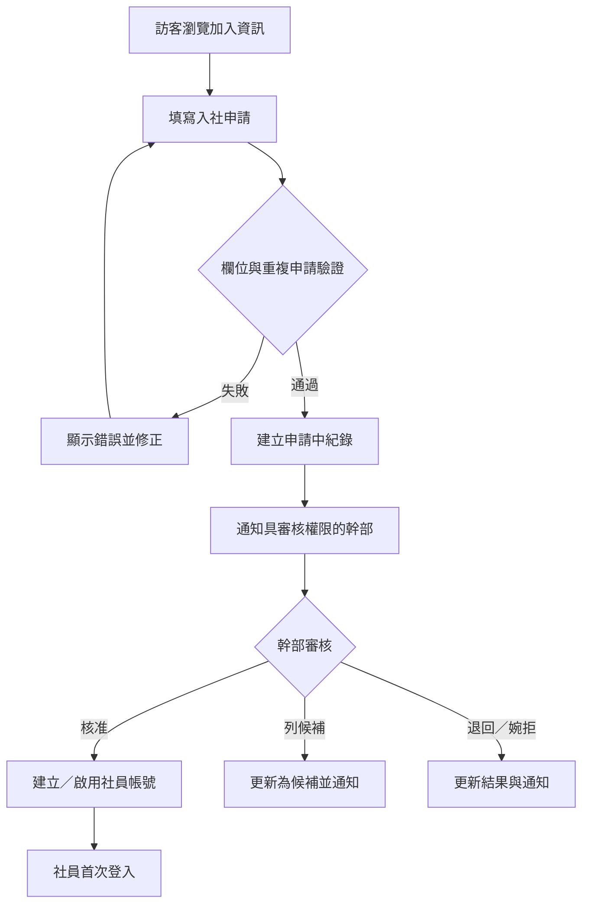
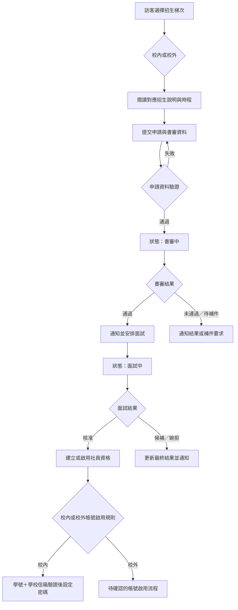
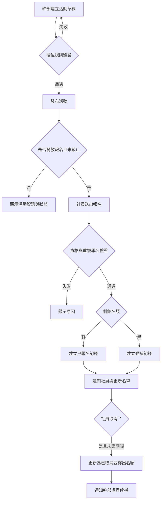
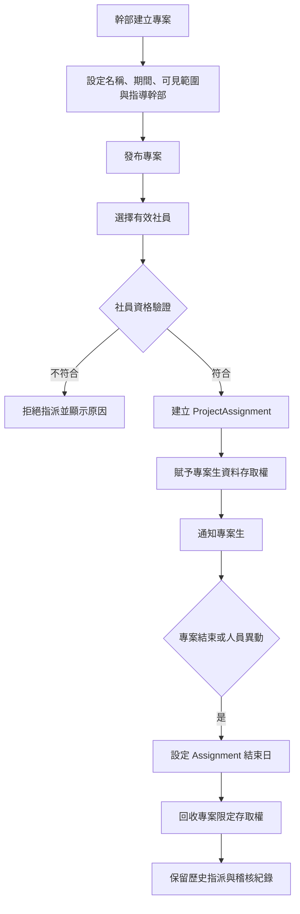
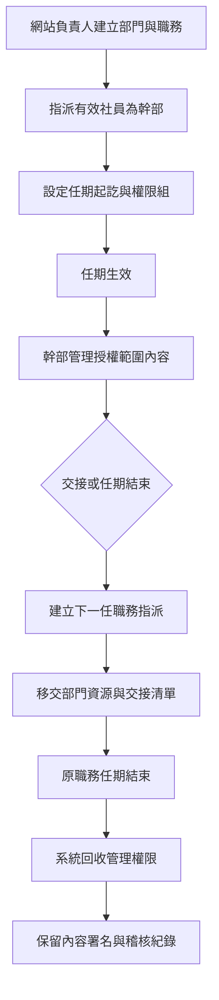
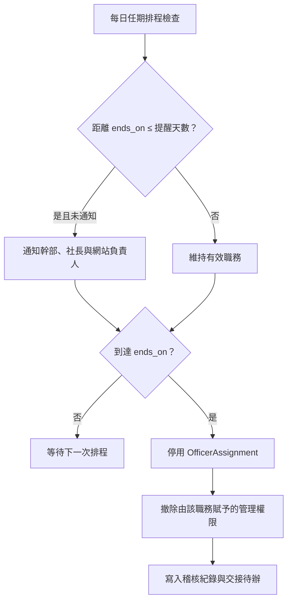

# 02｜核心作業流程規格

**狀態：** Draft v0.1  
**目的：** 將入社、活動、專案與幹部交接四條流程視覺化，作為後續 wireframe、API 與資料狀態設計的共同依據。

## 1. 入社申請與審核流程

| 流程控制點 | 規格 |
| --- | --- |
| 重複檢查 | 同 Email 存在「申請中」或「候補」紀錄時，不可重複建立申請。 |
| 審核權限 | 只有被授予 `membership.review` 的幹部或網站負責人可審核。 |
| 可追溯性 | 審核結果應寫入審核者、時間、原因與歷程，不可覆蓋原紀錄。 |
| 待確認 | 核准是否需要第二人覆核、候補是否有到期日、退回與婉拒的通知文案。 |

### 1.1 已確認的招生流程覆蓋規格

| 新增控制點 | 規格 |
| --- | --- |
| 招生梯次 | 校內、校外各自配置說明、開放日、書審截止、面試時段與公告日。 |
| 書審 | 審核者可登錄結果、評語、補件要求與時間；申請人只讀取對自身必要的結果。 |
| 面試 | 系統至少記錄面試安排、結果與審核歷程；視訊連結或面試細節只限審核相關人員。 |
| 帳號啟用 | 校內依已確認的學號與學校信箱認證；校外帳號流程列為阻塞性待決事項。 |

## 2. 活動建立、報名與取消流程

| 流程控制點 | 規格 |
| --- | --- |
| 名額一致性 | 報名與候補判斷須在後端交易中完成，避免多人同時報名造成超收。 |
| 取消權限 | 社員只能取消自己的有效報名；幹部可依授權代為取消。 |
| 狀態顯示 | 公開頁只顯示必要的報名／候補狀態，不顯示其他社員名單。 |
| 待確認 | 活動是否允許訪客報名、是否收費、取消期限與候補遞補機制。 |

## 3. 專案建立與專案生指派流程

| 流程控制點 | 規格 |
| --- | --- |
| 角色分離 | 專案生是 `ProjectAssignment`，幹部是 `OfficerAssignment`；同一人可以同時具備兩者。 |
| 存取範圍 | 專案資料預設只供所屬專案生與指導幹部讀取。 |
| 結案處理 | 結案後保留歷史紀錄，但專案資源是否仍允許下載必須由專案政策決定。 |
| 待確認 | 專案是否需要申請、是否可跨屆、每位專案生可加入專案上限。 |

## 4. 幹部任期與交接流程

| 流程控制點 | 規格 |
| --- | --- |
| 失效機制 | 任期結束後，原幹部不得再執行管理操作；不得依賴人工手動移除。 |
| 備援治理 | 網站負責人至少應有一位備援責任人，以避免單一帳號失效。 |
| 交接內容 | 部門 SOP、資源、活動草稿、待辦與權限清單需列入交接項目。 |
| 待確認 | 換屆日期、是否允許任期重疊、誰有權提前終止幹部任期。 |

### 4.1 任期到期通知覆蓋規格

