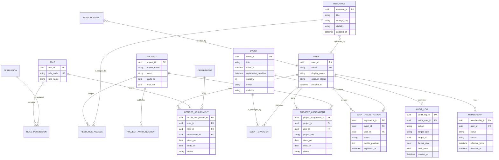

# 03｜角色、資料模型與權限規格

**狀態：** Draft v0.1  
**設計原則：** 以 RBAC 控制操作權限，以會員／專案／職務指派控制資料範圍；所有敏感操作均由伺服端驗證並寫入稽核紀錄。

## 1. 角色模型

系統不將「專案生」和「幹部」做成互斥帳號類型。使用者的身分應由三層關係組成：`User` 是登入主體；`Membership` 決定是否為有效社員；`ProjectAssignment` 與 `OfficerAssignment` 分別賦予專案資料範圍與職務權限。

| 系統概念 | 說明 | 是否可與其他概念重疊 |
| --- | --- | --- |
| **訪客** | 尚未登入或不具有效會員狀態的使用者。 | 是；登入後仍可能暫時是申請人。 |
| **社員** | `Membership.status = ACTIVE` 的使用者。 | 是；可同時是專案生與幹部。 |
| **專案生** | 具有效 `ProjectAssignment` 的社員。 | 是；可加入多個專案，亦可同時任幹部。 |
| **幹部** | 具有效 `OfficerAssignment`，且職務綁定權限組的社員。 | 是；可同時是專案生或其他部門幹部。 |
| **網站負責人** | 具最高治理權限的幹部；由社長或指定幹部兼任，非獨立技術人員職位。 | 是；應至少保留一位備援。 |

## 2. 權限代碼與矩陣

權限判斷規則分兩步：先判斷角色是否具有操作權限，再判斷該筆資料是否屬於可操作範圍。例如：活動部幹部可管理自己建立或獲授權的活動，但不必然可調整其他部門的專案。

| 權限代碼 | 說明 | 訪客 | 社員 | 專案生 | 幹部 | 網站負責人 |
| --- | --- | --- | --- | --- | --- |
| `public.read` | 讀取公開頁、公開公告與活動。 | ✓ | ✓ | ✓ | ✓ | ✓ |
| `membership.apply` | 提交入社申請。 | ✓ | — | — | — | — |
| `profile.manage.self` | 維護本人資料與通知偏好。 | — | ✓ | ✓ | ✓ | ✓ |
| `resource.read.member` | 讀取社員範圍資源。 | — | ✓ | ✓ | ✓ | ✓ |
| `project.read.assigned` | 讀取被指派專案的內容。 | — | — | ✓ | 指導／所屬專案 | ✓ |
| `project.manage.assigned` | 管理獲授權專案與其指派。 | — | — | — | ✓ | ✓ |
| `event.register.self` | 建立／取消本人活動報名。 | — | ✓ | ✓ | ✓ | ✓ |
| `event.manage.assigned` | 建立、發布、管理獲授權活動。 | — | — | — | ✓ | ✓ |
| `content.manage.assigned` | 建立、修改、排程與下架所屬內容。 | — | — | — | ✓ | ✓ |
| `membership.review` | 核准、列候補、退回或停用會員。 | — | — | — | 授權者 | ✓ |
| `officer.assign` | 設定幹部職務與任期。 | — | — | — | — | ✓ |
| `audit.read` | 讀取稽核紀錄。 | — | — | — | 所屬範圍 | ✓ |
| `data.export` | 匯出名單或資料。 | — | — | — | 所屬範圍 | ✓ |

> **MVP 控制要求：** 前端只能依權限隱藏或顯示功能入口；最終授權必須由後端依 `User + Role + Assignment + Object Scope` 驗證。前端不可成為唯一權限控制點。

## 3. 概念資料模型（ERD）

## 4. MVP 資料字典

| 實體 | 必要欄位 | 驗證與約束 | 資料敏感度 |
| --- | --- | --- | --- |
| `User` | user_id、email、display_name、account_status、created_at | Email 唯一；帳號狀態不可由一般使用者自行變更。 | 內部個人資料。 |
| `Membership` | user_id、status、cohort、effective_from、effective_to | 同一使用者在同一時間至多一筆有效會員狀態。 | 內部個人資料。 |
| `MembershipApplication` | applicant_name、email、申請資料、status、submitted_at、reviewed_by | 同 Email 同時僅一筆未結案申請；審核歷程不可覆蓋。 | 限審核者存取。 |
| `Department` | name、description、active | 部門名稱唯一；停用部門不可新增職務指派。 | 內部。 |
| `OfficerAssignment` | user_id、department_id、role_id、starts_on、ends_on、status | 必有起日；結束日不得早於起日；有效期才授權。 | 內部、治理。 |
| `Project` | project_name、status、starts_on、ends_on、visibility | 結束日不得早於開始日。 | 專案範圍。 |
| `ProjectAssignment` | project_id、user_id、project_role、starts_on、ends_on、status | 指派時須驗證有效社員；同人同專案不可重複有效指派。 | 專案範圍。 |
| `Event` | title、starts_at、ends_at、registration_deadline、capacity、status、visibility | `capacity >= 0`；截止時間不得晚於活動結束；發布前需完整欄位。 | 公開或內部。 |
| `EventRegistration` | event_id、user_id、status、waitlist_position、registered_at | 同人同活動只有一筆有效報名；候補序位僅在候補時存在。 | 內部個人資料。 |
| `Resource` | title、storage_key、visibility、owner_user_id、updated_at | `storage_key` 不可直接暴露為長期公開 URL；下載時再判權限。 | 依可見範圍。 |
| `AuditLog` | actor_user_id、action、target_type、target_id、created_at | 僅附加（append-only）；不可由一般幹部修改或刪除。 | 機密治理資料。 |

## 5. 狀態規格

### 5.1 會員與申請狀態

| 目前狀態 | 可轉換狀態 | 觸發者 | 說明 |
| --- | --- | --- | --- |
| `PENDING`（申請中） | `APPROVED`、`WAITLISTED`、`RETURNED`、`REJECTED` | 審核者 | 每次審核應保留決策原因。 |
| `APPROVED`（核准） | `ACTIVE` | 系統／網站負責人 | 建立或啟用 Membership 後成為有效社員。 |
| `WAITLISTED`（候補） | `APPROVED`、`REJECTED`、`EXPIRED` | 審核者／系統 | 候補到期規則待確認。 |
| `ACTIVE`（社員） | `INACTIVE`、`ALUMNI` | 授權者／交接流程 | 停用後失去社員與專案內容存取權。 |
| `INACTIVE`（停用／離社） | `ACTIVE` | 網站負責人 | 恢復時須記錄原因。 |
| `ALUMNI`（校友） | `ACTIVE`（例外） | 網站負責人 | MVP 預設不具社員資源權限。 |

### 5.2 活動與報名狀態

| 類別 | 狀態 | 說明 |
| --- | --- | --- |
| 活動 | `DRAFT`、`PUBLISHED`、`REGISTRATION_OPEN`、`FULL`、`CLOSED`、`CANCELLED`、`COMPLETED` | 狀態應由時間、名額與幹部操作共同決定；不可只依前端時間顯示。 |
| 報名 | `REGISTERED`、`WAITLISTED`、`CANCELLED`、`ATTENDED`、`ABSENT` | `ATTENDED` 與 `ABSENT` 由幹部在活動後登錄。 |

### 5.3 專案與指派狀態

| 類別 | 狀態 | 說明 |
| --- | --- | --- |
| 專案 | `DRAFT`、`ACTIVE`、`COMPLETED`、`ARCHIVED`、`CANCELLED` | `ARCHIVED` 保留歷史資料，預設禁止修改。 |
| 專案指派 | `PENDING`、`ACTIVE`、`ENDED`、`REMOVED` | MVP 可直接建立 `ACTIVE`；日後如需專案邀請再啟用 `PENDING`。 |

## 6. 資料範圍與存取策略

| 資料範圍 | 例子 | 存取原則 |
| --- | --- | --- |
| 公開 | 公開公告、公開活動、社團介紹。 | 無需登入。 |
| 社員 | 社員公告、一般教材、個人報名紀錄。 | 需有效 Membership。 |
| 專案 | 專案公告、專案資源、專案名單。 | 需有效 ProjectAssignment 或具該專案管理權限。 |
| 幹部 | 待審核申請、活動名單、管理草稿。 | 需具對應 permission 且符合部門／資料範圍。 |
| 治理 | 角色變更、稽核紀錄、資料匯出、備份資訊。 | 僅網站負責人；高風險行為需留痕。 |

## 7. 已確認決策增補：帳號與招生資料模型

本節是對前述 ERD 與資料字典的補充。校內與校外招生需要獨立的梯次與帳號啟用規則；因此，招生資料不應只存在於單一 `MembershipApplication` 欄位中。

| 新增或調整實體 | 關鍵欄位 | 規格 |
| --- | --- | --- |
| `RecruitmentCycle` | cycle_id、audience_type、title、description、opens_at、document_deadline、interview_starts_at、result_announced_at、status | `audience_type` 至少包含 `INTERNAL`、`EXTERNAL`；每梯次可有不同說明與時程。 |
| `MembershipApplication`（擴充） | application_id、cycle_id、applicant_type、student_number、school_email、external_email、status、submitted_at | 校內必填學號與學校信箱；校外資料欄位與帳號識別方式待決策。 |
| `ApplicationReview` | review_id、application_id、stage、reviewer_user_id、result、comment、reviewed_at | `stage` 至少包含 `DOCUMENT`、`INTERVIEW`；審核歷程採 append-only。 |
| `InterviewSchedule` | interview_id、application_id、starts_at、ends_at、format、location_or_link、status | 面試細節僅授權審核相關幹部與申請人查看。 |
| `AccountActivation` | activation_id、user_id／application_id、verification_channel、token_hash、expires_at、verified_at、password_set_at | 驗證碼／連結不可明文儲存；驗證後或到期後必須失效。 |
| `OfficerAssignment`（擴充） | notification_sent_at、revoked_at、revocation_reason | 支援任期到期前通知及到期自動撤權的稽核。 |

### 7.1 身分驗證與帳號規則

| 對象 | 已確認帳號規則 | 尚待確認內容 |
| --- | --- | --- |
| 校內申請者／社員 | 學號為帳號識別；認證碼與驗證連結發至學校信箱；完成驗證後才可設定或修改密碼。 | 是否每次登入皆需第二因子，或僅首度啟用／密碼重設時驗證。 |
| 校外申請者 | 可申請，但不得假設擁有學號或學校信箱。 | 暫時帳號格式、可驗證 Email、通過後正式帳號格式與登入規則。 |

### 7.2 申請狀態細化

| 目前狀態 | 可轉換狀態 | 說明 |
| --- | --- | --- |
| `SUBMITTED` | `DOCUMENT_REVIEW`、`RETURNED` | 申請資料已提交，等待完整性確認。 |
| `DOCUMENT_REVIEW` | `INTERVIEW_SCHEDULED`、`RETURNED`、`REJECTED` | 書審進行中。 |
| `INTERVIEW_SCHEDULED` | `INTERVIEW_COMPLETED`、`WITHDRAWN` | 已通知面試時間或連結。 |
| `INTERVIEW_COMPLETED` | `APPROVED`、`WAITLISTED`、`REJECTED` | 面試結果已登錄，等待最終決策。 |
| `APPROVED` | `ACCOUNT_ACTIVATION_PENDING`、`ACTIVE` | 校內經驗證後啟用；校外啟用流程待確認。 |
| `ACCOUNT_ACTIVATION_PENDING` | `ACTIVE`、`EXPIRED` | 使用者尚未完成帳號驗證與密碼設定。 |
