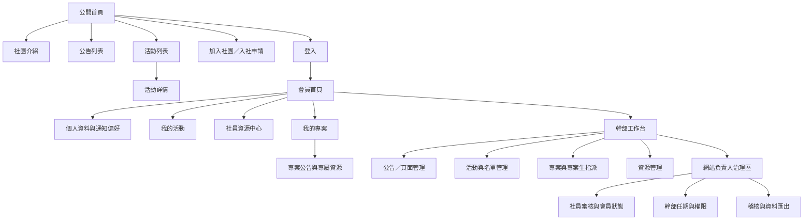

# 04｜資訊架構、RWD 與可近用性規格

**狀態：** Draft v0.1  
**設計原則：** Mobile-first、任務導向、權限可見、內容可掃讀。所有使用者都能在手機完成其核心任務；桌機版提供較高密度的管理與名單作業。

## 1. 網站資訊架構（Sitemap）

## 2. 頁面與元件清單

| 區域 | 頁面／元件 | 主要角色 | 核心任務 |
| --- | --- | --- | --- |
| 公開區 | 首頁 | 訪客 | 理解社團定位、近期公告與活動、前往加入或登入。 |
| 公開區 | 社團介紹／幹部介紹 | 訪客 | 了解社團宗旨、組織與聯絡方式。 |
| 公開區 | 公告列表／詳情 | 訪客、社員 | 瀏覽經發布的公開或社員範圍公告。 |
| 公開區 | 活動列表／詳情 | 訪客、社員 | 閱讀活動資訊，登入後完成報名。 |
| 公開區 | 入社申請 | 訪客 | 填寫、提交與查看申請結果。 |
| 會員區 | 會員首頁 | 社員、專案生、幹部 | 一眼查看個人待辦、近期活動、專案與通知。 |
| 會員區 | 我的活動 | 社員 | 查看報名、候補、取消與出席紀錄。 |
| 會員區 | 資源中心 | 社員、專案生 | 搜尋、篩選與下載被授權資源。 |
| 會員區 | 我的專案／專案詳情 | 專案生、幹部 | 讀取所屬專案的公告、成員與資源。 |
| 幹部區 | 幹部工作台 | 幹部 | 快速進入內容、活動、資源或專案管理。 |
| 幹部區 | 活動管理 | 幹部 | 建立活動、調整名額、檢視名單、登錄出席。 |
| 幹部區 | 專案管理 | 幹部 | 建立專案、設定指導幹部與指派專案生。 |
| 治理區 | 審核與會員管理 | 授權幹部、網站負責人 | 審核申請、查閱會員狀態、處理停用。 |
| 治理區 | 職務、任期與稽核 | 網站負責人 | 進行交接、回收權限、查看敏感操作紀錄。 |

## 3. 導覽與權限顯示規則

| 使用者狀態 | 桌面主導覽 | 行動主導覽 | 不可見項目 |
| --- | --- | --- | --- |
| 訪客 | 首頁、社團介紹、公告、活動、加入社團、登入。 | 漢堡選單；加入與登入放於首層。 | 會員首頁、資源、專案、幹部工作台。 |
| 社員 | 首頁、公告、活動、資源、我的活動、帳號選單。 | 漢堡選單＋固定的個人入口。 | 他人名單、幹部管理與治理功能。 |
| 專案生 | 社員導覽＋我的專案。 | 漢堡選單中顯示「我的專案」。 | 未被指派的專案。 |
| 幹部 | 社員導覽＋幹部工作台。 | 漢堡選單中顯示幹部工作台。 | 無授權的其他部門／專案資料。 |
| 網站負責人 | 幹部導覽＋治理入口。 | 治理入口位於帳號選單內，避免誤觸。 | 無；但高風險功能須再次確認。 |

## 4. 關鍵任務頁的 RWD 行為

「不跑版」的驗收要描述元件如何重排、資料如何呈現與行動操作如何完成，而不能只要求畫面「看起來正常」。

| 頁面／元件 | PC `≥1200px` | Tablet `768–1199px` | Mobile `320–767px` | 驗收條件 |
| --- | --- | --- | --- | --- |
| 公開首頁 | 雙欄或多欄內容、完整導覽。 | 欄數縮減、保留關鍵 CTA。 | 單欄內容、漢堡選單、加入／活動 CTA 優先。 | 320px 寬不產生非必要水平捲動。 |
| 活動列表 | 篩選器與卡片／表格並列。 | 篩選器換行、卡片兩欄或單欄。 | 篩選器為底部抽屜或折疊區，卡片單欄。 | 使用者可在手機篩選、查看與進入詳情。 |
| 活動詳情／報名 | 左側資訊、右側報名卡。 | 上下堆疊或窄側欄。 | 資訊在前、報名按鈕固定於安全區或內容尾端。 | 可單手完成報名，不被鍵盤遮住主要按鈕。 |
| 資源中心 | 左側分類、右側表格／列表。 | 分類改為上方篩選。 | 資源改為卡片摘要；下載與權限標記清楚。 | 檔名長時可截斷但可點開查看完整資訊。 |
| 活動名單 | 高密度表格、批次操作。 | 可橫向捲動的表格或重點欄位。 | 預設卡片列表；詳細欄位以展開面板顯示。 | 管理者可於手機查詢單筆名單；批次作業優先在桌機。 |
| 專案頁 | 側欄、公告、資源與成員分區。 | 側欄改為頂部分頁。 | 頂部分頁或下拉切換，內容單欄。 | 專案生可以在手機讀取公告與下載資源。 |
| 幹部編輯表單 | 多欄表單、右側即時摘要。 | 兩欄降為單欄或分組。 | 單欄、分步表單或摺疊區塊。 | 必填標示與錯誤訊息不只使用紅色表達。 |

## 5. 共用元件與設計系統規格

| 元件 | 最低規格 | RWD／可近用性要求 |
| --- | --- | --- |
| App Header | Logo、主導覽、帳號／登入入口。 | 行動版改抽屜；開啟時需鎖定背景、可用 ESC 關閉、焦點不可跳出選單。 |
| Page Header | 頁名、說明、麵包屑與角色／範圍標記。 | 手機版簡化麵包屑，保留頁名與返回路徑。 |
| Status Badge | 公開、社員、專案、草稿、活動狀態、候補等。 | 文字需直接說明狀態，不只使用顏色。 |
| Form Field | Label、說明、輸入、錯誤、成功狀態。 | Label 與欄位以程式關聯；錯誤可被螢幕閱讀器讀取。 |
| Data List／Table | 欄位、篩選、排序、空狀態、載入狀態。 | 手機改卡片或可展開摘要；不將所有欄位硬塞進螢幕。 |
| Dialog／Drawer | 確認、取消、危險操作、行動篩選。 | 焦點管理、鍵盤操作與明確關閉方式。 |
| File Item | 檔名、類型、更新日、可見範圍、下載按鈕。 | 下載前說明權限範圍；觸控按鈕有足夠尺寸。 |

## 6. 可近用性與內容規格

網站以 WCAG 2.2 AA 為目標，特別處理可感知、可操作、可理解與穩健四個面向。[1]

| 類別 | 實作規格 | 驗收方式 |
| --- | --- | --- |
| 鍵盤操作 | 所有互動元件可用 Tab、Shift+Tab、Enter、Space 與 Esc 完成。 | 手動鍵盤走查登入、申請、報名與建立活動流程。 |
| 焦點可見 | 焦點不被移除，且在淺色／深色背景均可辨識。 | 截圖與鍵盤測試。 |
| 色彩與文字 | 不以顏色作為唯一狀態訊號；文字與背景符合對比需求。 | 設計檢核與自動掃描。 |
| 表單錯誤 | 錯誤訊息清楚指向欄位、說明如何修正，並由輔助技術朗讀。 | 提交空白、格式錯誤與無權限情境。 |
| 圖片與檔案 | 功能性圖片具替代文字；裝飾圖可使用空替代文字；下載連結標示檔案類型。 | 內容審查與螢幕閱讀器抽查。 |
| 動態內容 | 載入、成功、失敗、候補變動等訊息以適當的 aria-live 傳達。 | 端對端測試與輔助技術抽查。 |

## 7. 關鍵流程原型檢查清單

在進入視覺設計或開發前，至少需要完成下列五條可點擊低保真原型；原型不需精緻，但必須包含正常、錯誤、空白與無權限狀態。

| 原型流程 | 必含畫面 | 驗證對象 |
| --- | --- | --- |
| 入社申請 | 加入入口、申請表、送出成功、資料錯誤、審核結果。 | 訪客代表、審核幹部。 |
| 社員活動報名 | 活動詳情、登入導向、報名成功、候補、取消。 | 社員代表、活動幹部。 |
| 專案生查看專案 | 我的專案、專案詳情、專案公告、專案資源、無權限。 | 專案生、指導幹部。 |
| 幹部建立活動 | 活動草稿、欄位驗證、發布確認、名單頁。 | 活動幹部。 |
| 幹部交接 | 任期設定、下一任指派、交接清單、原權限失效。 | 網站負責人、社長。 |

## 參考資料

[1]: https://www.w3.org/WAI/standards-guidelines/wcag/ "W3C Web Content Accessibility Guidelines (WCAG) 2 Overview"

## 8. 已確認決策增補：登入與招生流程介面

| 流程 | 必增頁面／狀態 | RWD／可近用性規格 |
| --- | --- | --- |
| 校內帳號啟用 | 學號輸入、學校信箱認證碼、驗證連結完成、設定／修改密碼、過期重寄。 | 驗證碼欄位支援貼上、鍵盤與手機數字鍵盤；連結開啟後顯示清楚的成功、過期與重寄狀態。 |
| 招生梯次選擇 | 校內／校外招生卡片、各自說明、時程、開始申請入口。 | 手機單欄、每張卡均顯示截止日與適用對象；不只以顏色區分校內／校外。 |
| 書審與面試狀態 | 申請進度時間軸：已送出、書審、補件、面試安排、結果。 | 進度以文字與日期表示；手機採直向時間軸，避免水平擠壓。 |
| 幹部任期提醒 | 後台待辦區、到期提醒、交接連結。 | 提醒不能只存在桌機儀表板；行動版需顯示可操作的交接待辦。 |
